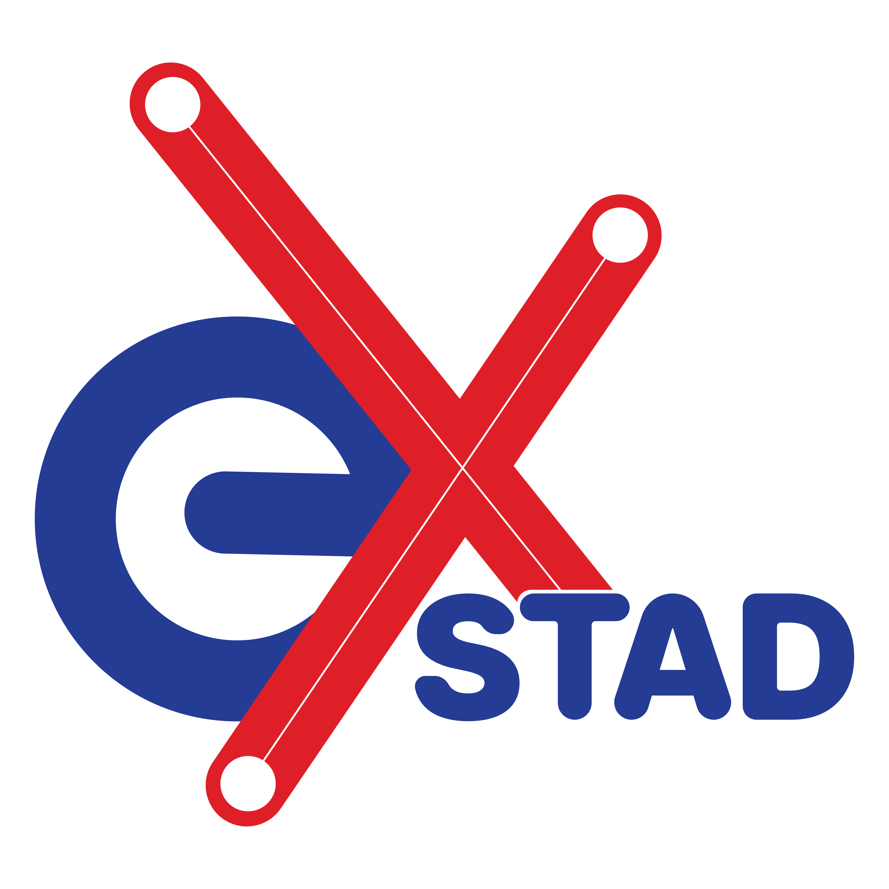
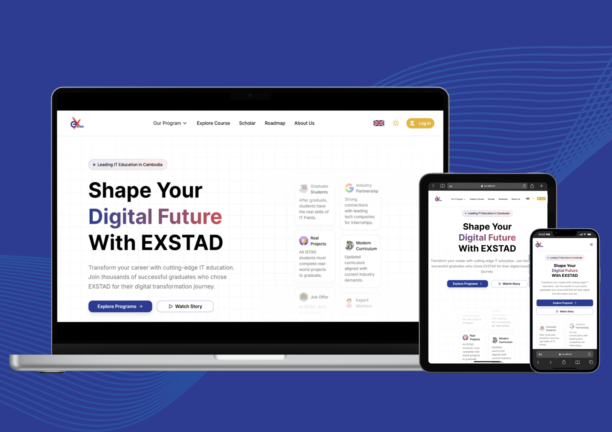

#  Welcome to exSTAD

`exSTAD` is a **full-stack web application** designed for **Cambodian students** to explore **ISTAD’s scholarships, courses, projects, and achievements** — all in one unified digital platform.

It serves as a **portal for sharing scholar experiences** and connecting students directly with ISTAD.  
Developed by the **1st Generation Full Stack Web Development Students** at the **Institute of Science and Technology Advanced Development (ISTAD)**,  
**exSTAD reimagines the learning management experience** for administrators, instructors, and students alike.

---

##  exSTAD Logo
<p align="center">
  
</p>

---

##  Introduction
In today’s digital era, **exSTAD** transforms how **learning and academic management** are delivered.  
It acts as a **centralized platform** for managing ISTAD’s study programs — including:

- Scholarship opportunities  
- Course listings  
- Student enrollment  
- Instructor management  
- Digital verification profiles  

Built proudly by **Khmer students**, exSTAD aims to make education **more accessible, efficient, and engaging** for learners, teachers, and administrators alike.

---

##  Background
The **Institute of Science and Technology Advanced Development (ISTAD)** is committed to providing **advanced IT education and scholarship opportunities** for Cambodian students.

To make these opportunities more accessible and interactive, our team envisioned **exSTAD** — a modern web-based platform that bridges students and ISTAD through technology.

With exSTAD, users can:

-  Explore academic programs and scholarships  
-  Enroll seamlessly in study programs  
-  Access academic records and verified achievements online  
-  Strengthen the connection between students and the institute  

---

 *exSTAD — Empowering Cambodian students through technology and innovation.*


## Key Feature

### 1. Information Listing
The first and most important feature of **exSTAD** is **Information Listing**.  
Our team designed a **modern and intuitive experience** that allows users—especially students—to easily explore everything about **ISTAD**:
- Scholarships  
- Short Courses  
- Roadmaps  
- Projects  
- Achievements  
- Scholar Alumni  

This feature opens a **digital space for IT students in Cambodia** to connect, learn, and start their IT careers with ISTAD.

---

### 2. Up Your Skill
The second feature, which we call **“Up Your Skill,”** helps students grow in their IT journey.  
ISTAD provides a wide range of opportunities such as **scholarships, sharing events, IT roadmaps, and short courses**—all of which are accessible directly on exSTAD.

Students can easily:
1. Fill in their basic information  
2. Choose their favorite course  
3. Select a schedule  

And that’s it — enrollment is done **in just a few minutes**.

Some programs even allow users to **track their registration, verify details, and get real-time updates** on schedules or announcements before it’s too late.

Additionally, exSTAD offers **free IT roadmaps** to help students plan their learning path.  
If they ever have questions or need guidance, **ISTAD provides free consultations** to support them throughout their journey.

---

### 3. Digital Verification Profile
To recognize every student’s effort and journey with ISTAD, we built the **Digital Verification Profile** — a secure and trusted digital record of their achievements.

Each profile includes:
- Certificates  
- Transcripts  
- Completed Training Courses  
- Accomplishment Projects  

This feature helps students **showcase their verified skills and credentials** to employers, allowing companies and HR departments to easily **verify authenticity** and **evaluate talent** based on real achievements.

---

### 4. System Management
Behind the scenes, exSTAD is powered by a robust **System Management** module designed for **Admins, Instructors, and Students**.  
Each role has specific permissions and tools to manage their responsibilities efficiently.

Core management functionalities include:
- User & Role Management  
- Program Management  
- Scholar Management  
- Enrollment Management  
- Digital Verification Asset Management (Certificates, Transcripts, Student Info)

This system delivers a **powerful and dynamic dashboard** experience with **comprehensive functionality** for all platform users.

---

## Live Platform

This project is currently deployed and can be accessed at:

🚀 Live Demo: [https://www.exstad.tech](https://www.exstad.tech)

---
# exSTAD Project — Technology Stack

The **exSTAD** platform is powered by a robust combination of modern frontend, backend, and DevOps technologies — ensuring performance, scalability, security, and a delightful user experience.

---

## Frontend Technologies

### Core Framework & Libraries
- **Next.js (App Router)** – React-based full-stack framework supporting SSR, SSG, and client-side rendering for optimal performance.  
- **React.js** – Component-based JavaScript library for building interactive, reusable user interfaces.  
- **TypeScript** – Adds static typing for improved code reliability, scalability, and developer productivity.  

### Styling & UI Components
- **Tailwind CSS** – Utility-first CSS framework enabling rapid and responsive UI design.  
- **Shadcn/UI Components** – Accessible, customizable component system built with Radix UI and Tailwind CSS.  
- **Radix UI** – Low-level UI primitives ensuring accessibility and consistent components.  
- **CSS3** – Modern styling language supporting animations, transitions, and responsive layouts.  
- **HTML5** – Semantic markup ensuring accessibility and SEO optimization.  
- **Framer Motion / Animate.css / AOS** – Libraries for smooth animations and scroll-triggered effects.  

### State Management & Logic
- **Redux Toolkit (RTK)** – Predictable state management for complex UI data flow.  
- **RTK Query / React Query** – Efficient data fetching, caching, and synchronization with backend APIs.  
- **Formik + Zod** – Type-safe form handling and schema validation.  
- **JavaScript (ES6+)** – Modern JavaScript syntax and features for logic and functionality.  

---

## Backend Technologies

### Core Framework
- **Spring Boot** – Enterprise-grade Java framework for building RESTful APIs and scalable backend services.  

### Authentication & Authorization
- **Keycloak** – Open-source identity and access management tool for secure authentication and role-based access control.  
- **JWT (JSON Web Token)** – Token-based authentication for secure API access.

### Object Storage
- **MinIO** – High-performance object storage server for storing files, media, and large objects, compatible with S3 APIs.  

### Reporting
- **JasperReports** – Java-based reporting tool used to generate dynamic reports and certificates in PDF or other formats.

### Database 
- **PostgreSQL** – Advanced, open-source relational database ensuring data consistency, scalability, and reliability.  
---

## Payment Integration
- **Bakong Payment Gateway** – Cambodia’s National Bank–backed FinTech platform for secure, instant transactions and enrollment payments.  
  Provides:
  - Student registration payments  
  - Real-time transaction validation  
  - Secure digital wallet integration  

---

## DevOps & Deployment

### Containerization & Infrastructure
- **Docker** – Containerization platform for packaging and deploying applications in isolated environments.  
- **Docker Compose / Microservices Architecture** – Simplifies multi-container orchestration and scalable service management.

### Web Server & Hosting
- **NGINX** – High-performance reverse proxy for load balancing, caching, and SSL termination.  
- **Cloud Deployment (VPS / Cloud Instance)** – Ensures scalability, reliability, and high availability of the platform.  
- **CI/CD Pipeline** – Continuous integration and deployment pipelines for automated testing, building, and deployment.

---

## Supporting Libraries & Tools
- **NextAuth.js** – Authentication and session management for frontend users.  
- **Next-Intl** – Multi-language localization and translation handling.  
- **Sonner** – Elegant toast notifications for better user feedback.  
- **Lucide React & React Icons** – Modern, consistent iconography.  
- **Class Variance Authority & clsx** – Simplifies dynamic class management in components.  
- **PostCSS & Autoprefixer** – Ensures CSS compatibility across browsers.  
- **Postman** – API testing and documentation.  
- **Visual Studio Code** – Main development environment.  
- **IntelliJ IDEA** – Primary IDE for backend development.

---

## Design & Workflow
- **Figma** – User interface design and prototyping.  
- **FigJam** – Workflow and UX journey mapping.  
- **Draw.io / Navicat** – ERD, UML, and system architecture diagrams.  
- **GitHub** – Version control and collaboration.

---

## Summary

> The **exSTAD** ecosystem is a blend of cutting-edge technologies — combining **Next.js + React** for an exceptional frontend, **Spring Boot + PostgreSQL** for a reliable backend, **MinIO** for object storage, **Bakong** for secure digital payments, and **Docker + NGINX** for seamless deployment.

Together, they ensure that **exSTAD** is:
- **Fast and responsive**  
- **Secure and scalable**  
- **Beautifully designed**  
- **Maintainable and developer-friendly**

---

## Navigation Structure — Public Pages

| Endpoint | URL | Description |
|----------|-----|-------------|
| Home Page | [https://www.exstad.tech/](https://www.exstad.tech/) | Overview of courses, achievements, and partners. |
| Short Courses | [https://www.exstad.tech/our-program/short-courses](https://www.exstad.tech/our-program/short-courses) | Lists all short courses with details. |
| Explore Courses | [https://www.exstad.tech/explore-course](https://www.exstad.tech/explore-course) | Browse all courses with filters and enrollment info. |
| Enrollment | [https://www.exstad.tech/explore-course/foundation/enrollment](https://www.exstad.tech/explore-course/foundation/enrollment) | Foundation course registration form. |
| Scholars | [https://www.exstad.tech/scholar](https://www.exstad.tech/scholar) | Displays ISTAD students and alumni success stories. |
| Student Roadmap | [https://www.exstad.tech/roadmap](https://www.exstad.tech/roadmap) | Guides students through learning and career steps. |
| About Us | [https://www.exstad.tech/about-us](https://www.exstad.tech/about-us) | ISTAD mission, vision, and values. |
| Student Dashboard | [https://www.exstad.tech/student-dashboard](https://www.exstad.tech/student-dashboard) | Profile, courses, certificates, and achievements. |
| Account Settings | [https://www.exstad.tech/student-dashboard-setting](https://www.exstad.tech/student-dashboard-setting) | Manage student account info; uses Keycloak for login. |

---

## 🚀 Quick Start

### Prerequisites
- Node.js 18+
- npm or yarn
- PostgreSQL database
- Keycloak server (for authentication)

### Installation
Clone the repository:

```bash
git clone https://github.com/your-org/exstad.git
cd exstad
```
Install dependencies:

```bash
npm install
```

Environment Setup

```bash
cp .env.example .env.local
```
Configure environment variables in .env.local:

```bash
# Next.js / NextAuth
NEXTAUTH_URL=http://localhost:3000
NEXTAUTH_SECRET=your-nextauth-secret

# Keycloak
KEYCLOAK_ISSUER=https://auth.exstad.tech/realms/exstad
KEYCLOAK_CLIENT_ID=exstad
KEYCLOAK_CLIENT_SECRET=your-keycloak-client-secret

# Backend API
API_BASE=https://api.exstad.tech
```
Start Development Server
#  Welcome to exSTAD

`exSTAD` is a **full-stack web application** designed for **Cambodian students** to explore **ISTAD’s scholarships, courses, projects, and achievements** — all in one unified digital platform.

It serves as a **portal for sharing scholar experiences** and connecting students directly with ISTAD.  
Developed by the **1st Generation Full Stack Web Development Students** at the **Institute of Science and Technology Advanced Development (ISTAD)**,  
**exSTAD reimagines the learning management experience** for administrators, instructors, and students alike.

---

##  exSTAD Logo
<p align="center">
  
</p>

---

## 📱 Platform Preview

<p align="center">
  
</p>

---

##  Introduction
In today’s digital era, **exSTAD** transforms how **learning and academic management** are delivered.  
It acts as a **centralized platform** for managing ISTAD’s study programs — including:

- Scholarship opportunities  
- Course listings  
- Student enrollment  
- Instructor management  
- Digital verification profiles  

Built proudly by **Khmer students**, exSTAD aims to make education **more accessible, efficient, and engaging** for learners, teachers, and administrators alike.

---

##  Background
The **Institute of Science and Technology Advanced Development (ISTAD)** is committed to providing **advanced IT education and scholarship opportunities** for Cambodian students.

To make these opportunities more accessible and interactive, our team envisioned **exSTAD** — a modern web-based platform that bridges students and ISTAD through technology.

With exSTAD, users can:

-  Explore academic programs and scholarships  
-  Enroll seamlessly in study programs  
-  Access academic records and verified achievements online  
-  Strengthen the connection between students and the institute  

---

 *exSTAD — Empowering Cambodian students through technology and innovation.*


## Key Feature

### 1. Information Listing
The first and most important feature of **exSTAD** is **Information Listing**.  
Our team designed a **modern and intuitive experience** that allows users—especially students—to easily explore everything about **ISTAD**:
- Scholarships  
- Short Courses  
- Roadmaps  
- Projects  
- Achievements  
- Scholar Alumni  

This feature opens a **digital space for IT students in Cambodia** to connect, learn, and start their IT careers with ISTAD.

---

### 2. Up Your Skill
The second feature, which we call **“Up Your Skill,”** helps students grow in their IT journey.  
ISTAD provides a wide range of opportunities such as **scholarships, sharing events, IT roadmaps, and short courses**—all of which are accessible directly on exSTAD.

Students can easily:
1. Fill in their basic information  
2. Choose their favorite course  
3. Select a schedule   

And that’s it — enrollment is done **in just a few minutes**.

Some programs even allow users to **track their registration, verify details, and get real-time updates** on schedules or announcements before it’s too late.

Additionally, exSTAD offers **free IT roadmaps** to help students plan their learning path.  
If they ever have questions or need guidance, **ISTAD provides free consultations** to support them throughout their journey.

---

### 3. Digital Verification Profile
To recognize every student’s effort and journey with ISTAD, we built the **Digital Verification Profile** — a secure and trusted digital record of their achievements.

Each profile includes:
- Certificates  
- Transcripts  
- Completed Training Courses  
- Accomplishment Projects  

This feature helps students **showcase their verified skills and credentials** to employers, allowing companies and HR departments to easily **verify authenticity** and **evaluate talent** based on real achievements.

---

### 4. System Management
Behind the scenes, exSTAD is powered by a robust **System Management** module designed for **Admins, Instructors, and Students**.  
Each role has specific permissions and tools to manage their responsibilities efficiently.

Core management functionalities include:
- User & Role Management  
- Program Management  
- Scholar Management  
- Enrollment Management  
- Digital Verification Asset Management (Certificates, Transcripts, Student Info)

This system delivers a **powerful and dynamic dashboard** experience with **comprehensive functionality** for all platform users.

---

## Live Platform

This project is currently deployed and can be accessed at:

🚀 Live Demo: [https://www.exstad.tech](https://www.exstad.tech)

---
# exSTAD Project — Technology Stack

The **exSTAD** platform is powered by a robust combination of modern frontend, backend, and DevOps technologies — ensuring performance, scalability, security, and a delightful user experience.

---

## Frontend Technologies

### Core Framework & Libraries
- **Next.js (App Router)** – React-based full-stack framework supporting SSR, SSG, and client-side rendering for optimal performance.  
- **React.js** – Component-based JavaScript library for building interactive, reusable user interfaces.  
- **TypeScript** – Adds static typing for improved code reliability, scalability, and developer productivity.  

### Styling & UI Components
- **Tailwind CSS** – Utility-first CSS framework enabling rapid and responsive UI design.  
- **Shadcn/UI Components** – Accessible, customizable component system built with Radix UI and Tailwind CSS.  
- **Radix UI** – Low-level UI primitives ensuring accessibility and consistent components.  
- **CSS3** – Modern styling language supporting animations, transitions, and responsive layouts.  
- **HTML5** – Semantic markup ensuring accessibility and SEO optimization.  
- **Framer Motion / Animate.css / AOS** – Libraries for smooth animations and scroll-triggered effects.  

### State Management & Logic
- **Redux Toolkit (RTK)** – Predictable state management for complex UI data flow.  
- **RTK Query / React Query** – Efficient data fetching, caching, and synchronization with backend APIs.  
- **Formik + Zod** – Type-safe form handling and schema validation.  
- **JavaScript (ES6+)** – Modern JavaScript syntax and features for logic and functionality.  

---

## Backend Technologies

### Core Framework
- **Spring Boot** – Enterprise-grade Java framework for building RESTful APIs and scalable backend services.  

### Authentication & Authorization
- **Keycloak** – Open-source identity and access management tool for secure authentication and role-based access control.  
- **JWT (JSON Web Token)** – Token-based authentication for secure API access.

### Object Storage
- **MinIO** – High-performance object storage server for storing files, media, and large objects, compatible with S3 APIs.  

### Reporting
- **JasperReports** – Java-based reporting tool used to generate dynamic reports and certificates in PDF or other formats.

### Database 
- **PostgreSQL** – Advanced, open-source relational database ensuring data consistency, scalability, and reliability.  
---

## Payment Integration
- **Bakong Payment Gateway** – Cambodia’s National Bank–backed FinTech platform for secure, instant transactions and enrollment payments.  
  Provides:
  - Student registration payments  
  - Real-time transaction validation  
  - Secure digital wallet integration  

---

## DevOps & Deployment

### Containerization & Infrastructure
- **Docker** – Containerization platform for packaging and deploying applications in isolated environments.  
- **Docker Compose / Microservices Architecture** – Simplifies multi-container orchestration and scalable service management.

### Web Server & Hosting
- **NGINX** – High-performance reverse proxy for load balancing, caching, and SSL termination.  
- **Cloud Deployment (VPS / Cloud Instance)** – Ensures scalability, reliability, and high availability of the platform.  
- **CI/CD Pipeline** – Continuous integration and deployment pipelines for automated testing, building, and deployment.

---

## Supporting Libraries & Tools
- **NextAuth.js** – Authentication and session management for frontend users.  
- **Next-Intl** – Multi-language localization and translation handling.  
- **Sonner** – Elegant toast notifications for better user feedback.  
- **Lucide React & React Icons** – Modern, consistent iconography.  
- **Class Variance Authority & clsx** – Simplifies dynamic class management in components.  
- **PostCSS & Autoprefixer** – Ensures CSS compatibility across browsers.  
- **Postman** – API testing and documentation.  
- **Visual Studio Code** – Main development environment.  
- **IntelliJ IDEA** – Primary IDE for backend development.

---

## Design & Workflow
- **Figma** – User interface design and prototyping.  
- **FigJam** – Workflow and UX journey mapping.  
- **Draw.io / Navicat** – ERD, UML, and system architecture diagrams.  
- **GitHub** – Version control and collaboration.

---

## Summary

> The **exSTAD** ecosystem is a blend of cutting-edge technologies — combining **Next.js + React** for an exceptional frontend, **Spring Boot + PostgreSQL** for a reliable backend, **MinIO** for object storage, **Bakong** for secure digital payments, and **Docker + NGINX** for seamless deployment.

Together, they ensure that **exSTAD** is:
- **Fast and responsive**  
- **Secure and scalable**  
- **Beautifully designed**  
- **Maintainable and developer-friendly**

---

## Navigation Structure — Public Pages

| Endpoint | URL | Description |
|----------|-----|-------------|
| Home Page | [https://www.exstad.tech/](https://www.exstad.tech/) | Overview of courses, achievements, and partners. |
| Short Courses | [https://www.exstad.tech/our-program/short-courses](https://www.exstad.tech/our-program/short-courses) | Lists all short courses with details. |
| Explore Courses | [https://www.exstad.tech/explore-course](https://www.exstad.tech/explore-course) | Browse all courses with filters and enrollment info. |
| Enrollment | [https://www.exstad.tech/explore-course/foundation/enrollment](https://www.exstad.tech/explore-course/foundation/enrollment) | Foundation course registration form. |
| Scholars | [https://www.exstad.tech/scholar](https://www.exstad.tech/scholar) | Displays ISTAD students and alumni success stories. |
| Student Roadmap | [https://www.exstad.tech/roadmap](https://www.exstad.tech/roadmap) | Guides students through learning and career steps. |
| About Us | [https://www.exstad.tech/about-us](https://www.exstad.tech/about-us) | ISTAD mission, vision, and values. |
| Student Dashboard | [https://www.exstad.tech/student-dashboard](https://www.exstad.tech/student-dashboard) | Profile, courses, certificates, and achievements. |
| Account Settings | [https://www.exstad.tech/student-dashboard-setting](https://www.exstad.tech/student-dashboard-setting) | Manage student account info; uses Keycloak for login. |

---

## 🚀 Quick Start

### Prerequisites
- Node.js 18+
- npm or yarn
- PostgreSQL database
- Keycloak server (for authentication)

### Installation
Clone the repository:

```bash
git clone https://github.com/your-org/exstad.git
cd exstad
```
Install dependencies:

```bash
npm install
```

Environment Setup

```bash
cp .env.example .env.local
```
Configure environment variables in .env.local:

```bash
# Next.js / NextAuth
NEXTAUTH_URL=http://localhost:3000
NEXTAUTH_SECRET=your-nextauth-secret

# Keycloak
KEYCLOAK_ISSUER=https://auth.exstad.tech/realms/exstad
KEYCLOAK_CLIENT_ID=exstad
KEYCLOAK_CLIENT_SECRET=your-keycloak-client-secret

# Backend API
API_BASE=https://api.exstad.tech
```
Start Development Server
```bash
npm run dev
```

Open your browser at http://localhost:3000

###  Available Scripts

| Command                  | Description                        |
|--------------------------|------------------------------------|
| `npm run dev`            | Start development server           |
| `npm run build`          | Build production-ready application |
| `npm run start`          | Start production server            |
| `npm run lint`           | Run ESLint for code quality        |
| `npm run clean:node`     | Clean node_modules (Linux/macOS)  |
| `npm run clean:node:win` | Clean node_modules (Windows)      |


---

## 👥 Team Members

Created with ❤️ by the talented students of ISTAD (Institute of Science and Technology Advanced Development).

| Name                  | Role & Responsibilities                        |
|-----------------------|------------------------------------------------|
| Chunn Meyling         | Full Stack Developer (Font-end,UX/UI)         |
| Phum Sreynoch         | Full Stack Developer (Font-end,UX/UI)         |
| Leng Narak            | Full Stack Developer (Font-end,UX/UI)         |
| Kong Sisovandara      | Full Stack Developer (Font-end,UX/UI,Back-end)|
| Tong Bora             | Full Stack Developer (Font-end,UX/UI,Back-end)|
| Srun Oudomsambath     | Full Stack Developer (Font-end,UX/UI)         |
| Kung Sovannda         | Full Stack Developer (Font-end,UX/UI,Back-end)|               
| Tang Menghouy         | Full Stack Developer (Font-end,UX/UI)         |


---


## 🌟 Our Mentors

We extend our heartfelt gratitude to the mentors who guided us throughout this journey.

| Name              | Role / Contribution                                         |
|------------------|------------------------------------------------------------|
| 👩‍🏫 Mr. Chan Chhaya | Mentor – Guidance, Support, and Technical Advice          |
| 👨‍🏫 Ms. Eung Lyzhia | Mentor – Inspiration, Feedback, and Encouragement         |

Their invaluable guidance, patience, and unwavering support have been instrumental in bringing this project to life.  
We are deeply grateful for their dedication and belief in our abilities.

✨ Thank you for inspiring us to grow as developers!

---

## Conclusion

exSTAD stands as a proud achievement of ISTAD’s first-generation full-stack developers — a platform that unites technology, education, and opportunity.
It represents our commitment to:

Innovation: Modern technologies for modern learning

Growth: Supporting Cambodian students to build IT careers

Accessibility: Making education inclusive and available anytime, anywhere

✨ exSTAD — The Future of Learning Management in Cambodia.

---
Open your browser at http://localhost:3000

###  Available Scripts

| Command                  | Description                        |
|--------------------------|------------------------------------|
| `npm run dev`            | Start development server           |
| `npm run build`          | Build production-ready application |
| `npm run start`          | Start production server            |
| `npm run lint`           | Run ESLint for code quality        |
| `npm run clean:node`     | Clean node_modules (Linux/macOS)  |
| `npm run clean:node:win` | Clean node_modules (Windows)      |


---

## 👥 Team Members

Created with ❤️ by the talented students of ISTAD (Institute of Science and Technology Advanced Development).

| Name                  | Role & Responsibilities                        |
|-----------------------|------------------------------------------------|
| Chunn Meyling         | Full Stack Developer (Font-end,UX/UI)         |
| Phum Sreynoch         | Full Stack Developer (Font-end,UX/UI)         |
| Leng Narak            | Full Stack Developer (Font-end,UX/UI)         |
| Kong Sisovandara      | Full Stack Developer (Font-end,UX/UI,Back-end)|
| Tong Bora             | Full Stack Developer (Font-end,UX/UI,Back-end)|
| Srun Oudomsambath     | Full Stack Developer (Font-end,UX/UI)         |
| Kung Sovannda         | Full Stack Developer (Font-end,UX/UI,Back-end)|               
| Tang Menghouy         | Full Stack Developer (Font-end,UX/UI)         |


---


## 🌟 Our Mentors

We extend our heartfelt gratitude to the mentors who guided us throughout this journey.

| Name              | Role / Contribution                                         |
|------------------|------------------------------------------------------------|
| 👩‍🏫 Mr. Chan Chhaya | Mentor – Guidance, Support, and Technical Advice          |
| 👨‍🏫 Ms. Eung Lyzhia | Mentor – Inspiration, Feedback, and Encouragement         |

Their invaluable guidance, patience, and unwavering support have been instrumental in bringing this project to life.  
We are deeply grateful for their dedication and belief in our abilities.

✨ Thank you for inspiring us to grow as developers!

---

## Conclusion

exSTAD stands as a proud achievement of ISTAD’s first-generation full-stack developers — a platform that unites technology, education, and opportunity.
It represents our commitment to:

Innovation: Modern technologies for modern learning

Growth: Supporting Cambodian students to build IT careers

Accessibility: Making education inclusive and available anytime, anywhere

✨ exSTAD — The Future of Learning Management in Cambodia.

---